# sigrok-pylon-bms-decoders

PulseView/libsigrokdecode protocol decoders for validated BMS/inverter captures.

Active decoders:

- `Growatt RS485`: Growatt Modbus RTU frames over UART/RS485.
- `Growatt CAN`: Growatt low-voltage BMS/inverter frames over Classic CAN.
- `Deye CAN`: Deye-compatible low-voltage BMS frames over Classic CAN.
- `GoodWe CAN`: GoodWe-compatible low-voltage BMS frames over Classic CAN.
- `Pylon CAN`: Pylon-compatible low-voltage BMS frames over Classic CAN.
- `Pylon RS485`: Pylon-compatible ASCII frames over UART/RS485.
- `Victron CAN`: Victron-compatible low-voltage BMS frames over Classic CAN.
- `JKBMS Modbus`: JK BMS RS485 Modbus RTU runtime frames.
- `JKBMS CAN`: JK BMS native CAN V2.0 frames over Classic CAN.

Rule for this repository: `decoders/` contains only decoders that were validated
on captures and explicitly accepted for publication. Decoders that are still in
field test stay in the firmware/workbench repository until they are confirmed
again together, then copied here and installed.

Older screenshots and map notes can remain under `pictures/` and `docs/` while
those protocols are being reworked, but they are not active unless their decoder
folder exists under `decoders/`.

## Layout

```text
decoders/
  deye_can/
  goodwe_can/
  growatt_can/
  growatt_rs485/
  jkbms_modbus/
  jkbms_can/
  pylon_can/
  pylon_rs485/
  victron_can/
docs/
  decoder-implementation-checklist.md
  deye-can-frame-map.md
  goodwe-can-frame-map.md
  growatt-can-frame-map.md
  growatt-rs485-register-map.md
  jkbms-modbus-register-map.md
  jkbms-can-frame-map.md
  pylon-can-frame-map.md
  pylon-rs485-frame-map.md
  victron-can-frame-map.md
examples/
  README.md
  bridge/
  direct/
  bridge_forward/
pictures/
  deye_can/
  goodwe_can/
  growatt_can/
  growatt_rs485/
  jkbms_modbus/
  jkbms_can/
  pylon_can/
  pylon_rs485/
  victron_can/
tests/
install-pulseview-decoders.ps1
start-pulseview.ps1
```

## Quick Start On Windows

For the most reliable PulseView setup, install a combined decoder directory
under `C:\ProgramData`:

```powershell
.\install-pulseview-decoders.ps1
```

This copies PulseView's built-in decoders plus all validated custom decoders
from `decoders/` into:

```text
C:\ProgramData\libsigrokdecode\decoders
```

It also sets the user `SIGROKDECODE_DIR` environment variable and creates
PulseView shortcuts.

For development, run PulseView with a temporary generated decoder bundle
instead:

```powershell
.\start-pulseview.ps1
```

That keeps built-in decoders such as `UART` and `CAN` visible while adding the
custom BMS decoders from this repo.

## Example Captures

The `examples/` directory separates field captures by communication topology
and translator mode. See `examples/README.md` for the current raw data and
PulseView session tables.

## Protocol Maps

Every active protocol decoder must have a matching map document under `docs/`.
Use [Decoder Implementation Checklist](docs/decoder-implementation-checklist.md)
before adding or merging a new decoder.

Active maps:

- [Deye CAN Frame Map](docs/deye-can-frame-map.md)
- [GoodWe CAN Frame Map](docs/goodwe-can-frame-map.md)
- [Growatt CAN Frame Map](docs/growatt-can-frame-map.md)
- [Growatt RS485 Register Map](docs/growatt-rs485-register-map.md)
- [JKBMS Modbus Register Map](docs/jkbms-modbus-register-map.md)
- [JKBMS CAN Frame Map](docs/jkbms-can-frame-map.md)
- [Pylon CAN Frame Map](docs/pylon-can-frame-map.md)
- [Pylon RS485 Frame Map](docs/pylon-rs485-frame-map.md)
- [Victron CAN Frame Map](docs/victron-can-frame-map.md)

## Growatt RS485 Decoder

`decoders/growatt_rs485` stacks above the built-in `UART` decoder:

```text
logic -> uart -> growatt_rs485
```

Typical settings:

- baud: `9600`
- data bits: `8`
- parity: `none`
- stop bits: `1`
- bit order: `lsb-first`
- line inversion: depends on the probe point/transceiver output

The decoder handles Growatt Modbus RTU requests, responses, exceptions, CRC
checks, and known BMS register blocks including status, protection flags, SOC,
pack voltage/current, cell extremes, and cell voltage registers.

## Growatt CAN Decoder

`decoders/growatt_can` is a standalone decoder. Add `Growatt CAN` directly from
the PulseView decoder selector.

Typical settings:

- nominal bitrate: `500000`
- fast bitrate: unused for Classic CAN; leave at `500000`
- sample point: start with `70%`; try `75%` or `80%` if annotations are unstable
- input mode:
  - `rx/canl-direct` for transceiver `RXD` or digitized `CANL`
  - `canh-inverted` for digitized `CANH` when recessive/dominant are inverted
  - `canh-canl-diff` with CH0 as `CANH` and CH1 as `CANL`

The decoder covers the Growatt low-voltage CAN frame IDs used by the bridge,
including pack telemetry, limits, status/alarms, cell extremes, temperatures,
and metadata frames.

## Deye CAN Decoder

`decoders/deye_can` is a standalone decoder. Add `Deye CAN` directly from the
PulseView decoder selector.

Typical settings:

- nominal bitrate: `500000`
- fast bitrate: unused for Classic CAN; leave at `500000`
- sample point: start with `70%`; try `75%` or `80%` if annotations are unstable
- input mode:
  - `rx/canl-direct` for transceiver `RXD` or digitized `CANL`
  - `canh-inverted` for digitized `CANH` when recessive/dominant are inverted
  - `canh-canl-diff` with CH0 as `CANH` and CH1 as `CANL`

The current published decoder is visible in PulseView as
`Deye CAN v2026.07.03a`. It handles the validated Deye-compatible low-voltage
CAN dialect used by the bridge: charge/discharge limits, SOC/SOH, pack
voltage/current/temperature, module info, status flags, identity, temperature
extremes, cell-voltage extremes, and the matching index frame.

The current bridge-mode raw capture and PulseView session are listed in
`examples/README.md` as `Deye CAN`.

## GoodWe CAN Decoder

`decoders/goodwe_can` is a standalone decoder. Add `GoodWe CAN` directly from
the PulseView decoder selector.

Typical settings:

- nominal bitrate: `500000`
- fast bitrate: unused for Classic CAN; leave at `500000`
- sample point: start with `70%`; try `75%` or `80%` if annotations are unstable
- input mode:
  - `rx/canl-direct` for transceiver `RXD` or digitized `CANL`
  - `canh-inverted` for digitized `CANH` when recessive/dominant are inverted
  - `canh-canl-diff` with CH0 as `CANH` and CH1 as `CANL`

The current published decoder is visible in PulseView as
`GoodWe CAN v2026.07.03a`. It handles GoodWe native low-voltage frames for
modules, alarms, limits, SOC/SOH, and pack telemetry, plus the JK/Pylon
compatibility dialect observed in the bridge capture.

The current bridge-mode raw capture and PulseView session are listed in
`examples/README.md` as `GoodWe CAN`.

## Pylon CAN Decoder

`decoders/pylon_can` is a standalone decoder. Add `Pylon CAN` directly from
the PulseView decoder selector.

Typical settings:

- nominal bitrate: `500000`
- fast bitrate: unused for Classic CAN; leave at `500000`
- sample point: start with `70%`; try `75%` or `80%` if annotations are unstable
- input mode:
  - `rx/canl-direct` for transceiver `RXD` or digitized `CANL`
  - `canh-inverted` for digitized `CANH` when recessive/dominant are inverted
  - `canh-canl-diff` with CH0 as `CANH` and CH1 as `CANL`

The current published decoder is visible in PulseView as
`Pylon CAN v2026.07.03a`. It handles the validated Pylon-compatible
low-voltage profile used by the bridge: charge/discharge limits, SOC/SOH, pack
voltage/current/temperature, module info, status flags, identity text, cell
temperature frames, and JK/Pylon extension frames for temperature and cell
extremes.

The current bridge-mode raw capture and PulseView session are listed in
`examples/README.md` as `Pylon CAN`.

## Pylon RS485 Decoder

`decoders/pylon_rs485` stacks above the built-in `UART` decoder:

```text
logic -> uart -> pylon_rs485
```

Typical settings:

- baud: `9600`
- data bits: `8`
- parity: `none`
- stop bits: `1`
- bit order: `lsb-first`
- RX inversion: depends on the probe point; the current bridge capture uses
  UART `invert_rx=yes`

The current published decoder is visible in PulseView as
`Pylon RS485 v2026.07.03a`. It handles Pylon-compatible ASCII request/response
frames over UART/RS485, including frame fields, length/checksum validation,
`0x42` cell information, `0x61` analog telemetry, `0x62` alarm/status flags,
and `0x63` charge/discharge status.

The current bridge-mode raw capture and PulseView session are listed in
`examples/README.md` as `Pylon RS485`.

## Victron CAN Decoder

`decoders/victron_can` is a standalone decoder. Add `Victron CAN` directly from
the PulseView decoder selector.

Typical settings:

- nominal bitrate: `500000`
- fast bitrate: unused for Classic CAN; leave at `500000`
- sample point: start with `70%`; try `75%` or `80%` if annotations are unstable
- input mode:
  - `rx/canl-direct` for transceiver `RXD` or digitized `CANL`
  - `canh-inverted` for digitized `CANH` when recessive/dominant are inverted
  - `canh-canl-diff` with CH0 as `CANH` and CH1 as `CANL`

The current published decoder is visible in PulseView as
`Victron CAN v2026.07.03a`. It handles the validated Victron-compatible
low-voltage profile used by the bridge: charge/discharge limits, SOC/SOH, pack
voltage/current/temperature, alarms/status raw frames, vendor raw frames,
manufacturer text, battery raw words, and ASCII/raw extension frames.

The current bridge-mode raw capture and PulseView session are listed in
`examples/README.md` as `Victron CAN`.

## JKBMS CAN Decoder

`decoders/jkbms_can` is a standalone decoder. Add `JKBMS CAN` directly from the
PulseView decoder selector.

Typical settings:

- nominal bitrate: `250000`
- fast bitrate: unused for Classic CAN; leave at `250000`
- sample point: start with `70%`; try `75%` or `80%` if annotations are unstable
- input mode:
  - `rx/canl-direct` for transceiver `RXD` or digitized `CANL`
  - `canh-inverted` for digitized `CANH` when recessive/dominant are inverted
  - `canh-canl-diff` with CH0 as `CANH` and CH1 as `CANL`

The current published decoder is visible in PulseView as
`JKBMS CAN v2026.07.03a`. It handles the validated JK app profile
`000 - JK BMS CAN Protocol (250K) V2.0`: pack voltage/current/SOC, cell
extremes, temperature summary, alarm severity map, extended cell-voltage
frames, extended temperatures, capacity/cycles, raw BMS info/status frames, and
charge-info frames. Per-cell voltage decoding is capped to cells `1..25`,
matching the validated bridge implementation.

The current bridge-mode raw capture and PulseView session are listed in
`examples/README.md` as `JKBMS CAN`.

## JKBMS Modbus Decoder

`decoders/jkbms_modbus` stacks above the built-in `UART` decoder:

```text
logic -> uart -> jkbms_modbus
```

Typical logic-level UART settings:

- baud: `115200` for JK app profile `001 - JK BMS RS485 Modbus V1.0`
- baud: `9600` for JK app profile `013 - (9600) JK BMS RS485 Modbus V1.0`
- data bits: `8`
- parity: `none`
- stop bits: `1`
- bit order: `lsb-first`
- line inversion: depends on the probe point/transceiver output

For direct digital probing of RS485 A/B with the LA2016, validate both
polarities. The current field capture was checked with `115200 8N1`; the best
offline pass used `CH1`, RX invert `no`, and a UART sample point around `30%`.

The current published decoder is visible in PulseView as
`JKBMS Modbus v2026.07.02b`. It handles Modbus RTU requests, responses,
exceptions, CRC checks, and the JK runtime register map used by the bridge:
cell-voltage blocks, cell average/delta/index registers, MOS/battery
temperatures, pack voltage/current, SOC/SOH, capacities, cycles, and candidate
alarm/status fields.

## JKBMS Modbus Capture Screenshots

The current screenshots use a Growatt inverter, a JK BMS, RS485 through the
translator bridge, a Kingst LA2016 logic analyzer, and
`JKBMS Modbus v2026.07.02b`.

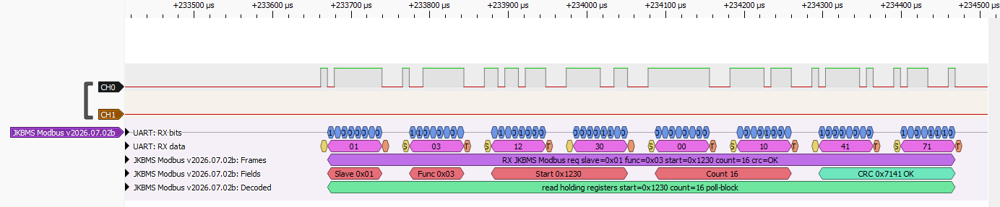

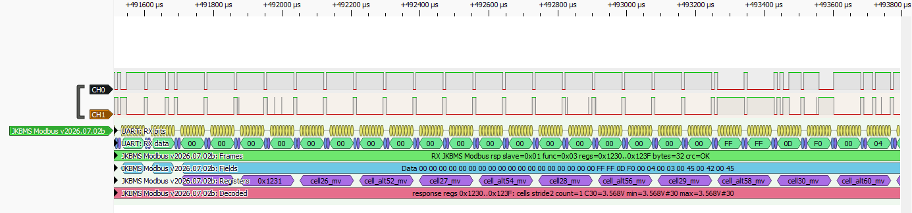

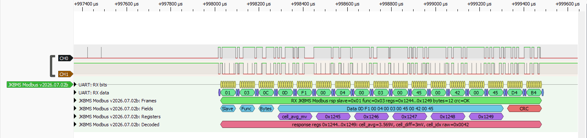

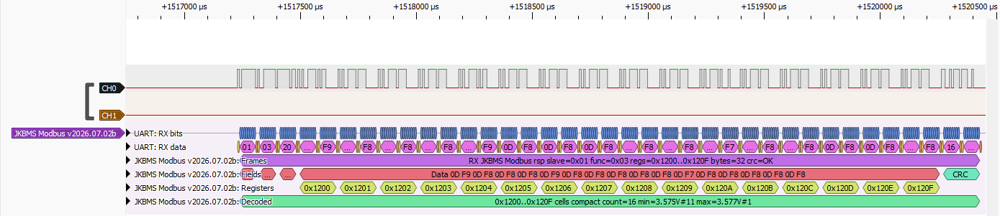

## JKBMS CAN Capture Screenshots

The current screenshots use a JK BMS CAN capture decoded with
`JKBMS CAN v2026.07.03a`.

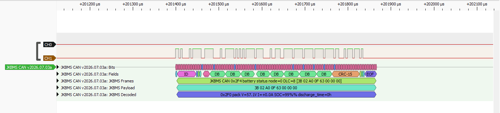

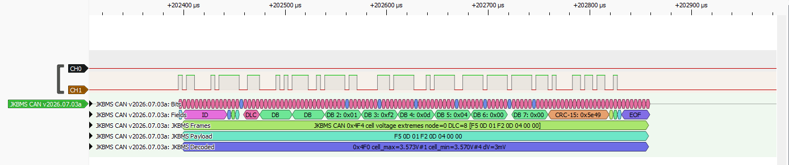

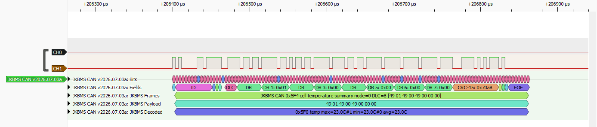

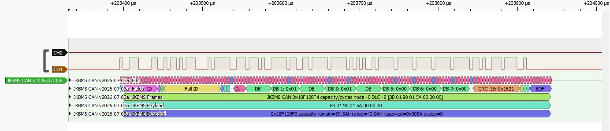

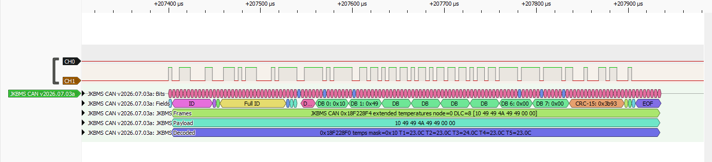

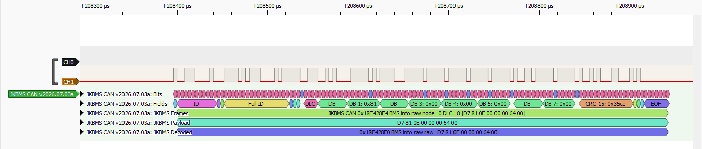

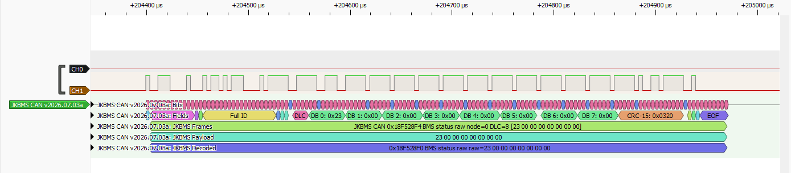

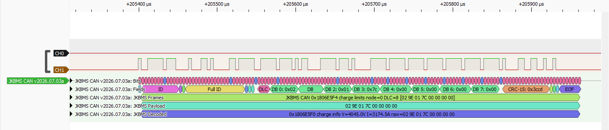

## Deye CAN Capture Screenshots

The current screenshots use a Deye-compatible CAN capture decoded with
`Deye CAN v2026.07.03a`.

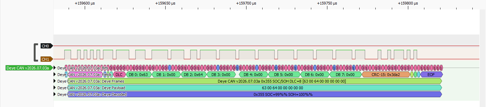

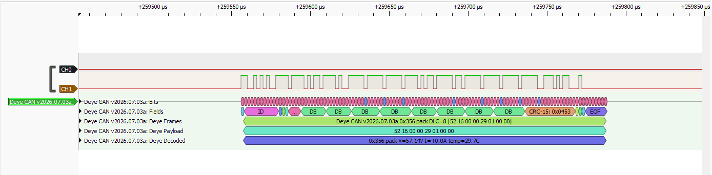

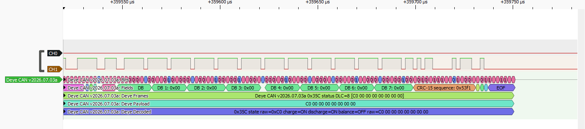

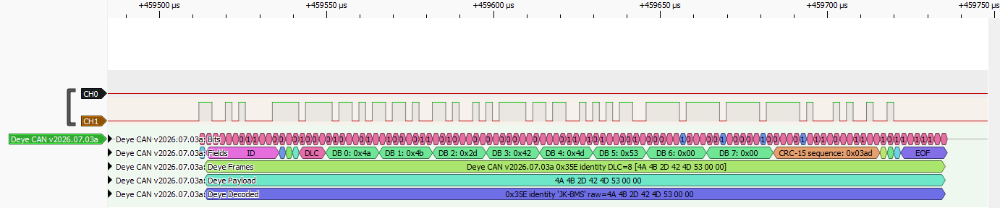

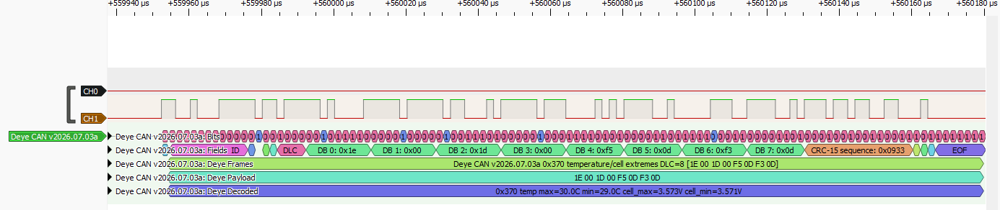

## GoodWe CAN Capture Screenshots

The current screenshots use a GoodWe-compatible CAN capture decoded with
`GoodWe CAN v2026.07.03a`.

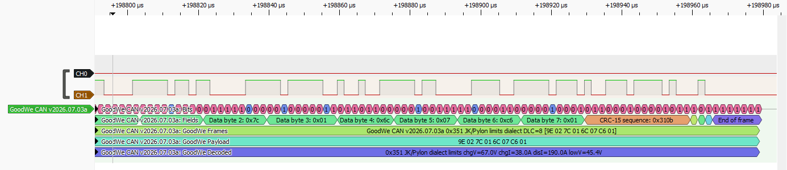

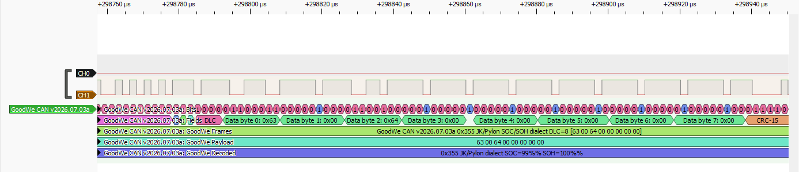

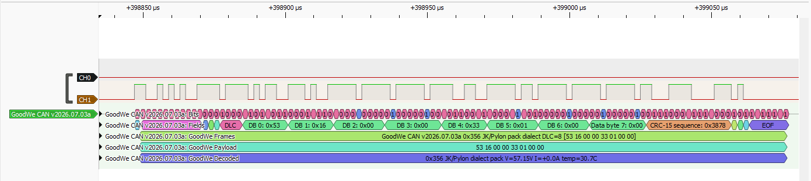

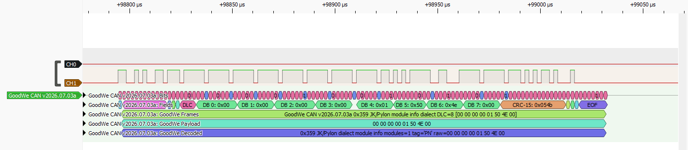

## Pylon CAN Capture Screenshots

The current screenshots use a Pylon-compatible CAN capture decoded with
`Pylon CAN v2026.07.03a`.


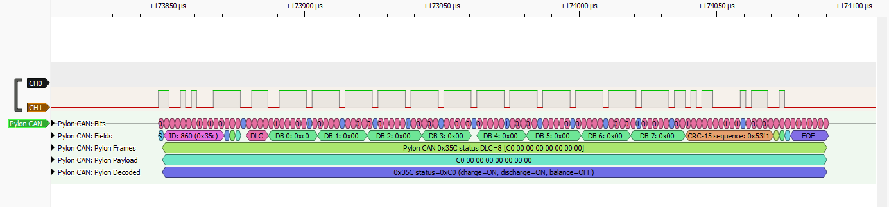

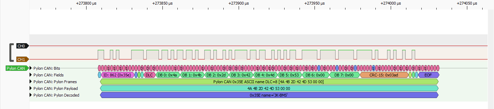

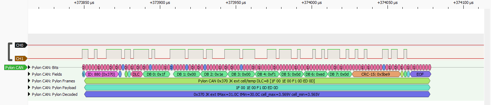


## Pylon RS485 Capture Screenshots

The current screenshots use a Pylon-compatible RS485 ASCII capture decoded with
`Pylon RS485 v2026.07.03a`.

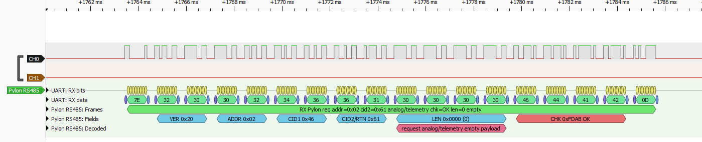


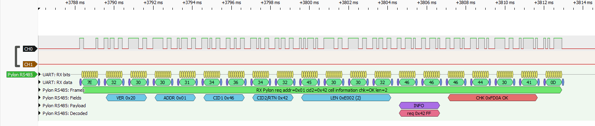

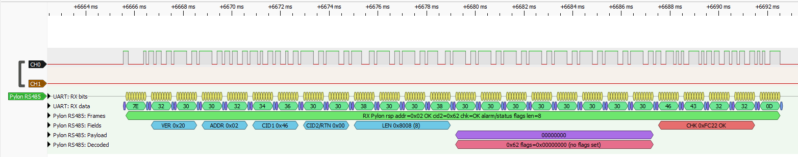

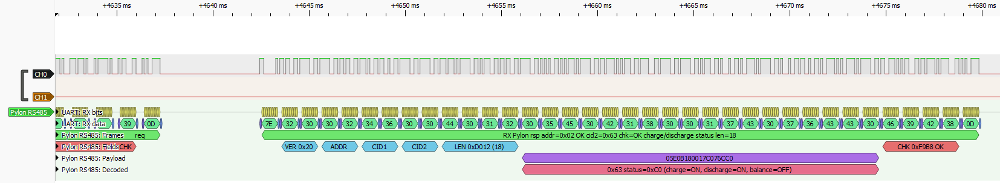

## Victron CAN Capture Screenshots

The current screenshots use a Victron-compatible CAN capture decoded with
`Victron CAN v2026.07.03a`.

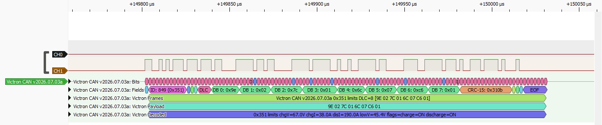

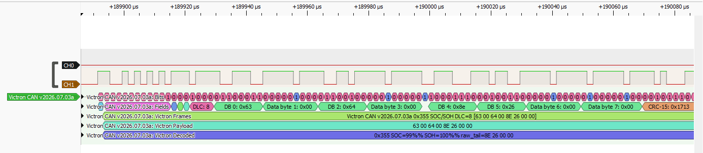

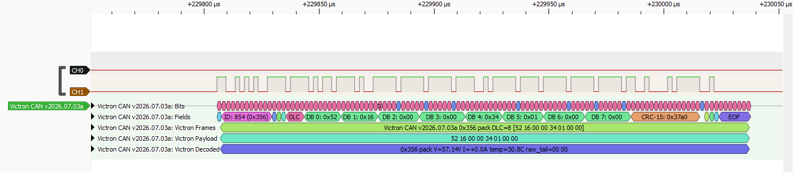

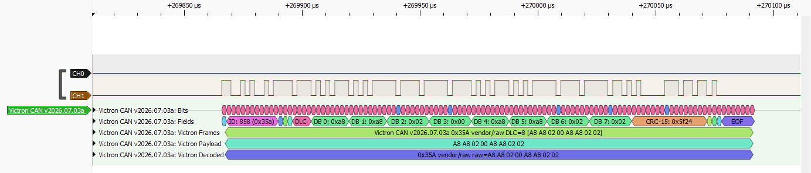

## Tests

Run parser/decoder helper tests with:

```powershell
python -m pytest tests -q
```

The tests do not require PulseView to be running.

