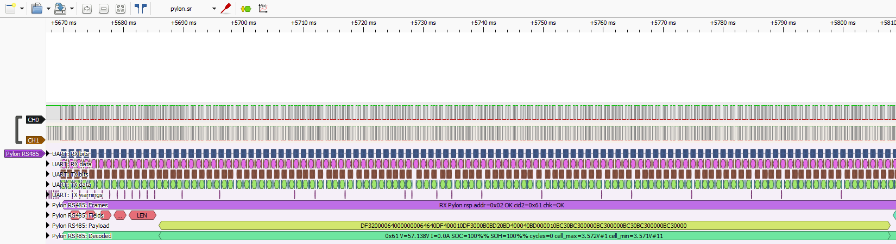
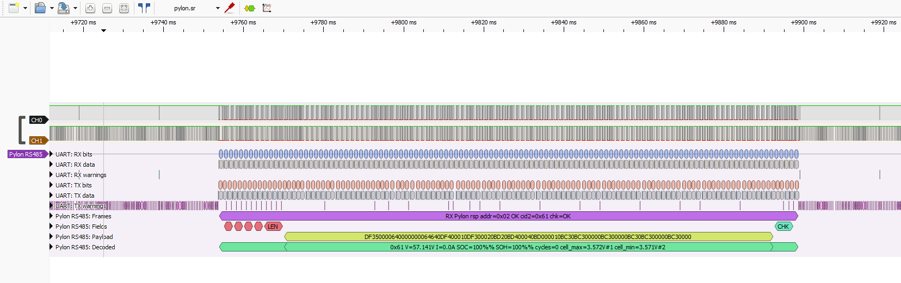
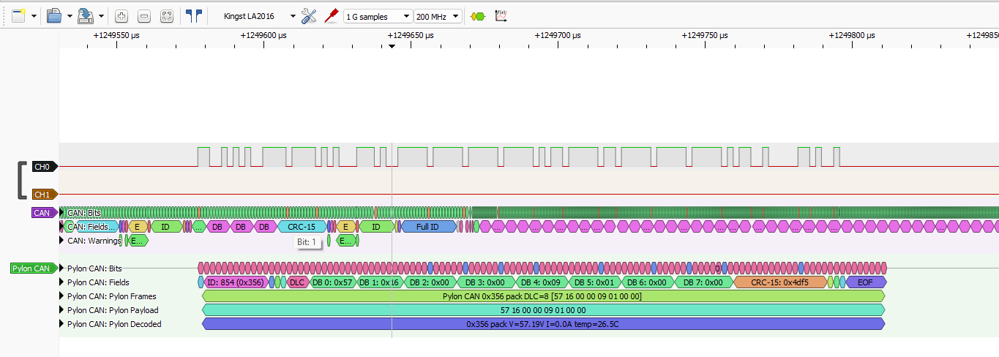
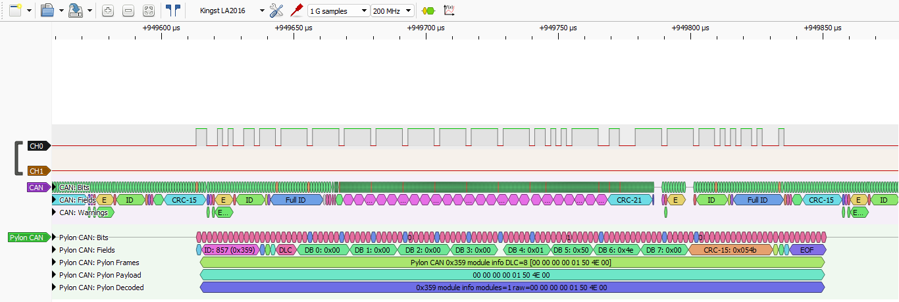
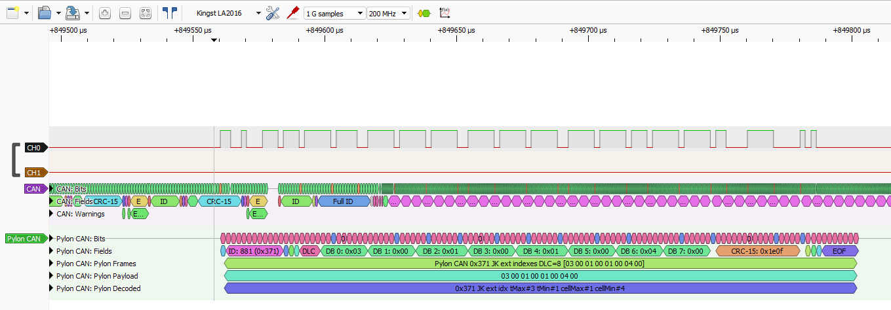

# sigrok-pylon-bms-decoders

PulseView/libsigrokdecode protocol decoders for Pylon-compatible BMS traffic.

This repository currently contains:

- `Pylon RS485`: ASCII Pylon-compatible frames over UART/RS485.
- `Pylon CAN`: Classic CAN Pylon-compatible frames, including field-tested JK/Pylon IDs.

The decoders were built around real captures from LA2016/PulseView sessions and are intended for practical inverter/BMS debugging.

## Layout

```text
decoders/
  pylon_rs485/
  pylon_can/
examples/
pictures/
tests/
install-pulseview-decoders.ps1
start-pulseview.ps1
```

## Quick Start On Windows

For the most reliable PulseView setup, install a combined decoder directory under `C:\ProgramData`:

```powershell
.\install-pulseview-decoders.ps1
```

This copies PulseView's built-in decoders plus these Pylon decoders into:

```text
C:\ProgramData\libsigrokdecode\decoders
```

It also sets the user `SIGROKDECODE_DIR` environment variable and creates a `PulseView Pylon` shortcut on the Desktop and in the Start Menu.

For development, run PulseView with a temporary generated decoder bundle instead:

```powershell
.\start-pulseview.ps1
```

That keeps built-in decoders such as `CAN` visible while adding `Pylon CAN` and `Pylon RS485`.

## Example Raw Captures

The `examples/` directory contains field captures that can be opened in
PulseView for decoder testing and protocol inspection:

| File | Description |
| --- | --- |
| `examples/pylon-can-raw-capture.sr` | Raw Pylon-compatible CAN capture. |
| `examples/pylon-can-pulseview-session.pvs` | PulseView session settings for the CAN capture. |
| `examples/pylon-rs485-raw-capture.sr` | Raw Pylon-compatible RS485 capture. |
| `examples/pylon-rs485-pulseview-session.pvs` | PulseView session settings for the RS485 capture. |

Open the `.sr` capture in PulseView, then load or recreate the matching `.pvs`
session if you want the same decoder/channel layout used in the screenshots.

## Pylon RS485 Decoder

`decoders/pylon_rs485` stacks above the built-in `UART` decoder:

```text
logic -> uart -> pylon_rs485
```

Typical settings:

- baud: `9600`
- data bits: `8`
- parity: `none`
- stop bits: `1`
- bit order: `lsb-first`
- line inversion: depends on the probe point/transceiver output

## Pylon RS485 Capture Examples

The screenshots below show real LA2016 captures decoded in PulseView with the
`Pylon RS485` decoder stacked above the built-in `UART` decoder.

### Analog / Telemetry Response `0x61`



`0x61` exposes pack voltage, current, SOC, SOH, cycle count, and cell min/max
summary data.

### Full Analog / Telemetry Frame `0x61`



The decoder annotates frame fields, payload, checksum status, and decoded
telemetry on the same capture.

### Status Flags Response `0x63`


`0x63` exposes Pylon-compatible charge, discharge, and balance status flags.

## Pylon CAN Decoder

`decoders/pylon_can` is a standalone decoder. Add `Pylon CAN` directly from the PulseView decoder selector.

Typical settings:

- nominal bitrate: `500000`
- fast bitrate: unused for Classic CAN; leave at `500000`
- sample point: start with `70%`, then try `75%` or `80%` if needed

Input modes:

- `rx/canl-direct`: use with transceiver `RXD`, or with digitized `CANL` when recessive is `1` and dominant is `0`.
- `canh-inverted`: use with digitized `CANH` when recessive is `0` and dominant is `1`.
- `canh-canl-diff`: use CH0 as `CANH` and optional CH1 as `CANL`; this derives the CAN RX logic level from the digitized wire states.

The decoder currently annotates known Pylon/JK CAN IDs including `0x351`, `0x355`, `0x356`, `0x359`, `0x35C`, `0x35E`, `0x370`, `0x371`, and `0x373`.

## Pylon CAN Capture Examples

The screenshots below show real LA2016 captures decoded in PulseView with the
`Pylon CAN` decoder.

### Limits Frame `0x351`


`0x351` exposes charge voltage, charge current, discharge current, and low
voltage limits.

### SOC / SOH Frame `0x355`


`0x355` carries state of charge and state of health.

### Pack Telemetry Frame `0x356`



`0x356` carries pack voltage, current, and temperature.

### Module Info Frame `0x359`



`0x359` carries module-count/module-info style data used by Pylon-compatible
inverters.

### JK Cell Index Extension `0x371`



`0x371` is a JK/Pylon extension that exposes temperature and cell min/max
indexes.

## Tests

Run parser/decoder helper tests with:

```powershell
python -m pytest tests -q
```

The tests do not require PulseView to be running, but the package import tests expect a normal PulseView installation at `C:\Program Files\sigrok\PulseView` on Windows.
