# sigrok-pylon-bms-decoders

PulseView/libsigrokdecode protocol decoders for Pylon-compatible and Growatt
BMS traffic.

This repository currently contains:

- `Pylon RS485`: ASCII Pylon-compatible frames over UART/RS485.
- `Pylon CAN`: Classic CAN Pylon-compatible frames, including field-tested JK/Pylon IDs.
- `Growatt RS485`: Growatt Modbus RTU frames over UART/RS485.
- `Growatt CAN`: Growatt low-voltage BMS/inverter frames over Classic CAN.

The decoders were built around real captures from LA2016/PulseView sessions and are intended for practical inverter/BMS debugging.

## Layout

```text
decoders/
  pylon_rs485/
  pylon_can/
  growatt_rs485/
  growatt_can/
examples/
  bridge/
  direct/
  bridge_forward/
pictures/
  pylon_rs485/
  pylon_can/
  growatt_can/
  growatt_rs485/
tests/
install-pulseview-decoders.ps1
start-pulseview.ps1
```

## Quick Start On Windows

For the most reliable PulseView setup, install a combined decoder directory under `C:\ProgramData`:

```powershell
.\install-pulseview-decoders.ps1
```

This copies PulseView's built-in decoders plus all custom decoders from
`decoders/` into:

```text
C:\ProgramData\libsigrokdecode\decoders
```

It also sets the user `SIGROKDECODE_DIR` environment variable and creates a
`PulseView BMS` shortcut on the Desktop and in the Start Menu.

For development, run PulseView with a temporary generated decoder bundle instead:

```powershell
.\start-pulseview.ps1
```

That keeps built-in decoders such as `CAN` visible while adding the custom BMS
decoders from this repo.

## Example Captures

The `examples/` directory separates field captures by communication topology:

- `examples/bridge/`: traffic passes through the bridge; the inverter is not connected directly to the BMS.
- `examples/direct/`: inverter and BMS communicate directly.
- `examples/bridge_forward/`: traffic passes through the bridge in forward mode.

Current raw captures are bridge-mediated captures:

| Topology | Bridge mode | Protocol | File | Description |
| --- | --- | --- | --- | --- |
| Bridge | Normal bridge | Growatt CAN | `examples/bridge/growatt-can-pulseview-session.pvs` | PulseView session settings for the Growatt CAN capture. |
| Bridge | Normal bridge | Growatt RS485 | `examples/bridge/growatt-rs485-pulseview-session.pvs` | PulseView session settings for the Growatt RS485 capture. |
| Bridge | Normal bridge | JKBMS/Pylon CAN | `examples/bridge/pylon-can-pulseview-session.pvs` | PulseView session settings for the Pylon CAN capture. |
| Bridge | Normal bridge | JKBMS/Pylon RS485 | `examples/bridge/pylon-rs485-pulseview-session.pvs` | PulseView session settings for the Pylon RS485 capture. |
| Bridge | Normal bridge | Growatt CAN | `examples/bridge/growatt-can-raw-capture.sr` | Raw Growatt CAN capture. |
| Bridge | Normal bridge | Growatt RS485 | `examples/bridge/growatt-rs485-raw-capture.sr` | Raw Growatt RS485 capture. |
| Bridge | Normal bridge | JKBMS/Pylon CAN | `examples/bridge/pylon-can-raw-capture.sr` | Raw Pylon-compatible CAN capture. |
| Bridge | Normal bridge | JKBMS/Pylon RS485 | `examples/bridge/pylon-rs485-raw-capture.sr` | Raw Pylon-compatible RS485 capture. |

Open the `.sr` capture in PulseView, then load or recreate the matching `.pvs`
session if you want the same decoder/channel layout used in the screenshots.

## Pylon RS485 Decoder

`decoders/pylon_rs485` stacks above the built-in `UART` decoder:

```text
logic -> uart -> pylon_rs485
```

Typical settings:

- baud: `9600`
- data bits: `8`
- parity: `none`
- stop bits: `1`
- bit order: `lsb-first`
- line inversion: depends on the probe point/transceiver output

## Pylon RS485 Capture Examples

The screenshots below show real LA2016 captures decoded in PulseView with the
`Pylon RS485` decoder stacked above the built-in `UART` decoder.

### Analog / Telemetry Response `0x61`

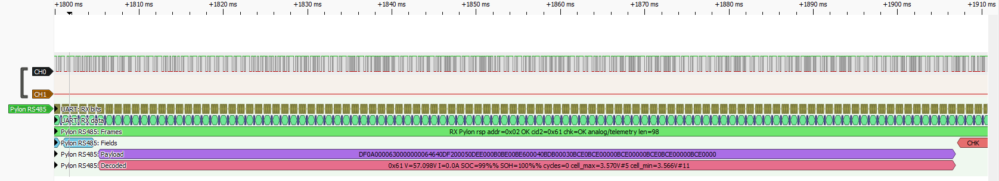

`0x61` exposes pack voltage, current, SOC, SOH, cycle count, and cell min/max
summary data.

### Full Analog / Telemetry Frame `0x61`


The decoder annotates frame fields, payload, checksum status, and decoded
telemetry on the same capture.

### Status Flags Response `0x63`

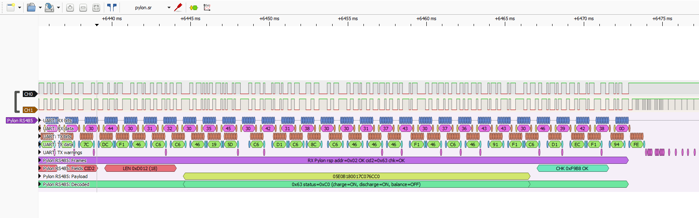

`0x63` exposes Pylon-compatible charge, discharge, and balance status flags.

## Pylon CAN Decoder

`decoders/pylon_can` is a standalone decoder. Add `Pylon CAN` directly from the PulseView decoder selector.

Typical settings:

- nominal bitrate: `500000`
- fast bitrate: unused for Classic CAN; leave at `500000`
- sample point: start with `70%`, then try `75%` or `80%` if needed

Input modes:

- `rx/canl-direct`: use with transceiver `RXD`, or with digitized `CANL` when recessive is `1` and dominant is `0`.
- `canh-inverted`: use with digitized `CANH` when recessive is `0` and dominant is `1`.
- `canh-canl-diff`: use CH0 as `CANH` and optional CH1 as `CANL`; this derives the CAN RX logic level from the digitized wire states.

The decoder currently annotates known Pylon/JK CAN IDs including `0x351`, `0x355`, `0x356`, `0x359`, `0x35C`, `0x35E`, `0x370`, `0x371`, and `0x373`.

## Pylon CAN Capture Examples

The screenshots below show real LA2016 captures decoded in PulseView with the
`Pylon CAN` decoder.

### Limits Frame `0x351`

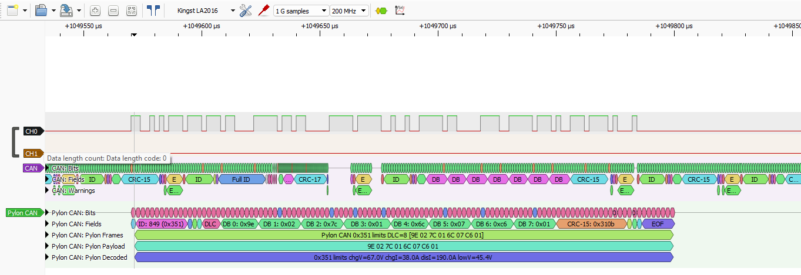

`0x351` exposes charge voltage, charge current, discharge current, and low
voltage limits.

### SOC / SOH Frame `0x355`

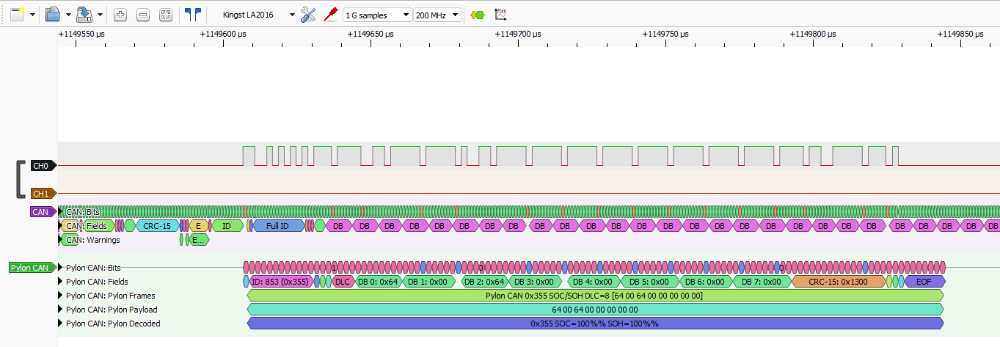

`0x355` carries state of charge and state of health.

### Pack Telemetry Frame `0x356`


`0x356` carries pack voltage, current, and temperature.

### Module Info Frame `0x359`


`0x359` carries module-count/module-info style data used by Pylon-compatible
inverters.

### JK Cell Index Extension `0x371`


`0x371` is a JK/Pylon extension that exposes temperature and cell min/max
indexes.

## Growatt CAN Decoder

`decoders/growatt_can` is a standalone decoder. Add `Growatt CAN` directly from
the PulseView decoder selector.

Typical settings:

- nominal bitrate: `500000`
- fast bitrate: unused for Classic CAN; leave at `500000`
- sample point: start with `70%`, then try `75%` or `80%` if needed

Input modes:

- `rx/canl-direct`: use with transceiver `RXD`, or with digitized `CANL` when recessive is `1` and dominant is `0`.
- `canh-inverted`: use with digitized `CANH` when recessive is `0` and dominant is `1`.
- `canh-canl-diff`: use CH0 as `CANH` and optional CH1 as `CANL`; this derives the CAN RX logic level from the digitized wire states.

The decoder currently annotates known Growatt CAN IDs including `0x211`,
`0x212`, `0x311` through `0x325`.

## Growatt CAN Capture Examples

The screenshots below show real LA2016 captures decoded in PulseView with the
`Growatt CAN` decoder.

### Status / Protections Frames `0x311` / `0x312`

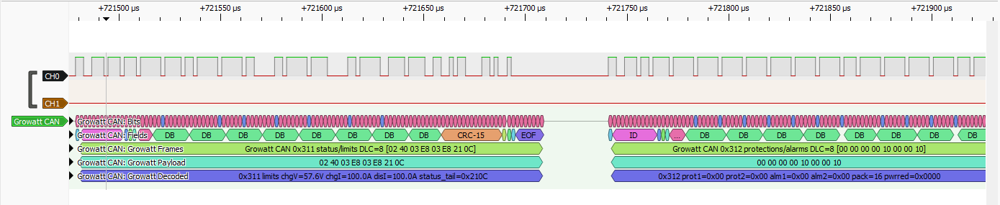

`0x311` exposes charge/discharge limits and status, while `0x312` carries
protection and alarm flags.

### Pack / Capacity Frames `0x313` / `0x314`

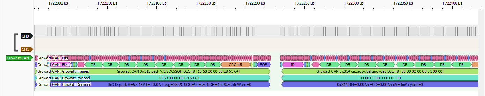

`0x313` carries pack voltage, current, temperature, SOC, and SOH. `0x314`
carries capacity, delta voltage, and cycle data.

### Cell Extremes / Maker Frames `0x319` / `0x320`

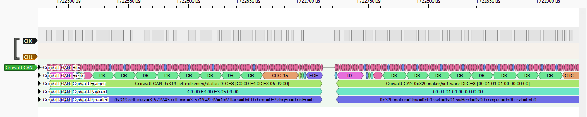

`0x319` exposes cell min/max values and status bits. `0x320` carries maker and
software metadata.

### Temperature / SOC Range Frame `0x322`

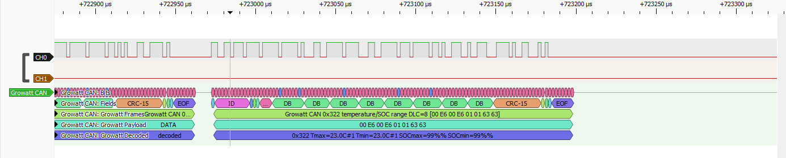

`0x322` carries temperature min/max indexes and SOC range values.

## Growatt RS485 Decoder

`decoders/growatt_rs485` stacks above the built-in `UART` decoder:

```text
logic -> uart -> growatt_rs485
```

Typical settings:

- baud: `9600`
- data bits: `8`
- parity: `none`
- stop bits: `1`
- bit order: `lsb-first`
- line inversion: depends on the probe point/transceiver output

The decoder handles Growatt Modbus RTU requests, responses, exceptions, CRC
checks, and known BMS register blocks including status, protection flags, SOC,
pack voltage/current, cell extremes, and cell voltage registers.

## Growatt RS485 Capture Examples

The screenshots below show real LA2016 captures decoded in PulseView with the
`Growatt RS485` decoder stacked above the built-in `UART` decoder.

### Request Block `0x0001..0x000F`

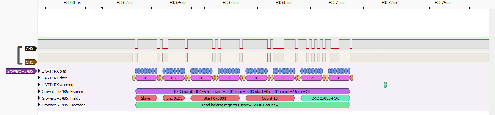

The decoder annotates Modbus slave, function, start register, count, and CRC.

### Response Block `0x0001..0x000F`

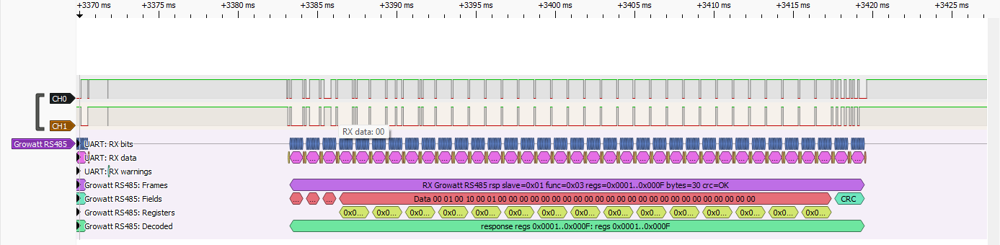

Unknown register blocks stay visible as raw register ranges while CRC and frame
boundaries are still checked.

### Status / Pack Block `0x0010..0x002A`

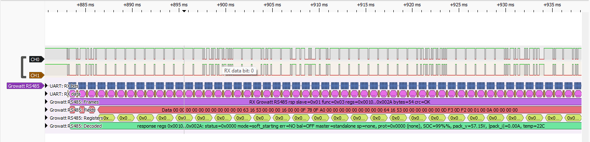

Known registers decode status flags, protection flags, SOC, pack voltage,
current, and temperature.

### Full Status / Pack Response `0x0010..0x002A`

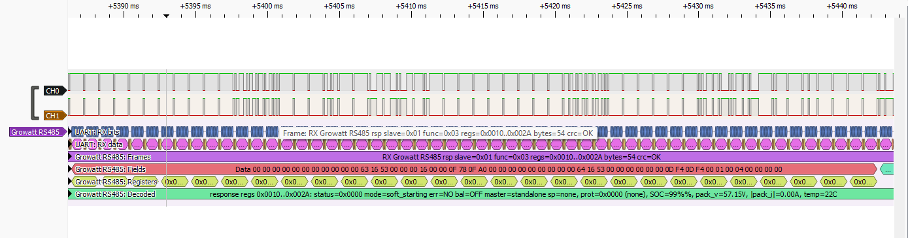

The full response view keeps the UART bytes, Modbus fields, register values, and
decoded summary aligned.

### Cell Voltage Block `0x0070..0x0080`

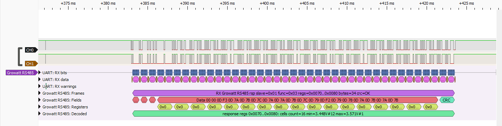

Cell voltage blocks decode count, min/max voltage, and cell indexes.

## Tests

Run parser/decoder helper tests with:

```powershell
python -m pytest tests -q
```

The tests do not require PulseView to be running.
